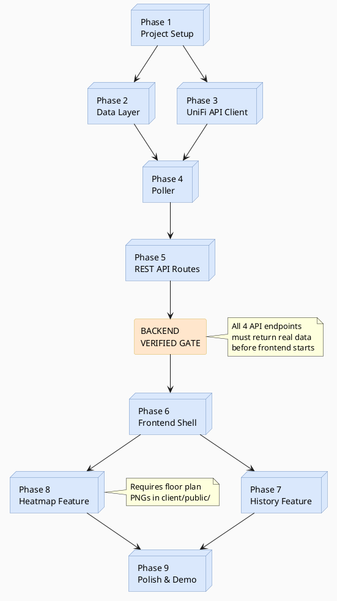

# JACHACKS ITS Challenge — Master Plan

**Project:** UniFi API Occupancy Dashboard
**Stack:** Node.js + Express + TypeScript · React + Vite + TypeScript · SQLite via Knex · node-cron · react-leaflet · Recharts

> Detailed plans are split into two separate documents:
> - [PLAN_BACKEND.md](PLAN_BACKEND.md) — Phase 1 (setup) through Phase 5 (REST API)
> - [PLAN_FRONTEND.md](PLAN_FRONTEND.md) — Phase 6 (frontend shell) through Phase 9 (polish)

---

## Phase Overview

| Phase | Track | Name | Primary Output | Est. |
|-------|-------|------|----------------|------|
| 1 | Backend | Project Setup | Monorepo scaffold, tooling, both dev servers start | 30 min |
| 2 | Backend | Data Layer | SQLite schema via Knex migrations, seed script | 25 min |
| 3 | Backend | UniFi API Client | Typed fetch wrappers, pagination, verified vs live API | 30 min |
| 4 | Backend | Poller | node-cron job writing snapshots every 5 min | 30 min |
| 5 | Backend | REST API Routes | All 4 endpoints returning real data | 25 min |
| — | **Gate** | **Backend Verified** | All endpoints confirmed before frontend starts | — |
| 6 | Frontend | Frontend Shell | React app, routing, AppShell, shared components | 30 min |
| 7 | Frontend | History Feature | Recharts time-series chart + table | 40 min |
| 8 | Frontend | Heatmap Feature | react-leaflet floor plan + AP circles | 50 min |
| 9 | Frontend | Polish & Demo Prep | Error states, loading skeletons, stale-data warnings | 25 min |

---

## Backend → Frontend Gate

Frontend work (Phase 6+) must not begin until all of the following pass:

```bash
# 1. Health check
curl http://localhost:3001/api/ping
# → { "ok": true }

# 2. Devices — must include building field and real AP names
curl http://localhost:3001/api/devices
# → [{ "id": "...", "name": "he401-ap-001", "building": "herzberg", ... }]

# 3. History — must have snapshot rows (run after at least one poller tick)
curl "http://localhost:3001/api/history"
# → [{ "captured_at": 1234567890, "client_count": 42 }, ...]

# 4. Heatmap — must show client_count values
curl http://localhost:3001/api/heatmap/current
# → [{ "ap_id": "...", "name": "he401-ap-001", "client_count": 12, ... }]
```

---

## Repository Structure

```
JACHACKS_ITS_CHALLENGE/
├── PLAN.md                   ← this file
├── PLAN_BACKEND.md           ← backend phases 1–5
├── PLAN_FRONTEND.md          ← frontend phases 6–9
├── package.json              ← root: concurrently dev script
├── .env                      ← API key, site ID, ports
├── server/                   ← Express + TypeScript backend
└── client/                   ← React + Vite frontend
```

---

## Phase Dependency Graph



---

## API Contract (Backend Guarantee to Frontend)

The backend guarantees these response shapes before frontend work begins:

### `GET /api/ping`
```json
{ "ok": true }
```

### `GET /api/devices`
```json
[
  {
    "id": "a2ab7a8e-b58d-32c4-b812-41adb00a56ca",
    "name": "he401-ap-001",
    "macAddress": "60:22:32:69:1a:d4",
    "building": "herzberg",
    "map_x": null,
    "map_y": null
  }
]
```

### `GET /api/history?from=&to=&ap_id=`
```json
[
  { "captured_at": 1712844300, "client_count": 47 },
  { "captured_at": 1712844600, "client_count": 51 }
]
```

### `GET /api/heatmap/current`
```json
[
  {
    "ap_id": "a2ab7a8e-b58d-32c4-b812-41adb00a56ca",
    "name": "he401-ap-001",
    "building": "herzberg",
    "map_x": null,
    "map_y": null,
    "client_count": 12
  }
]
```
