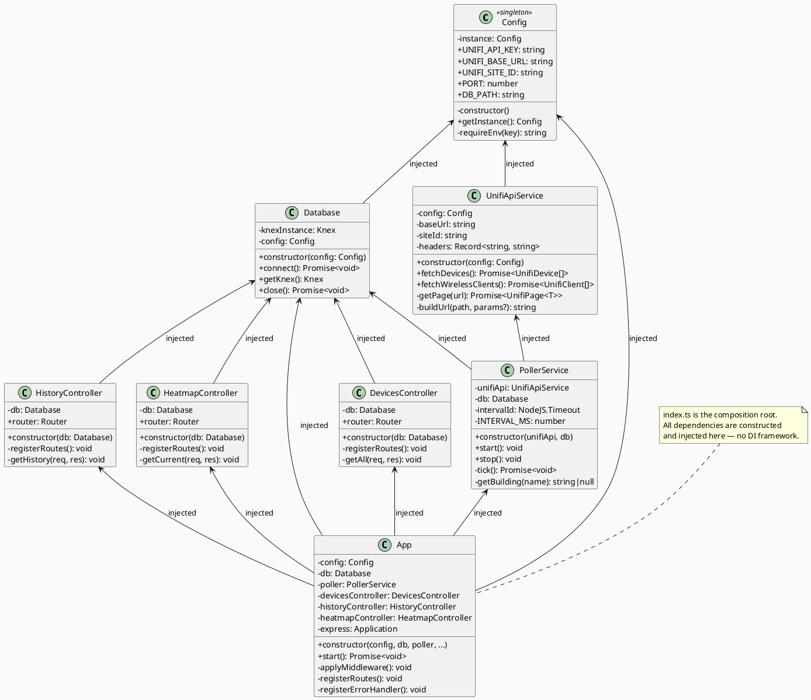
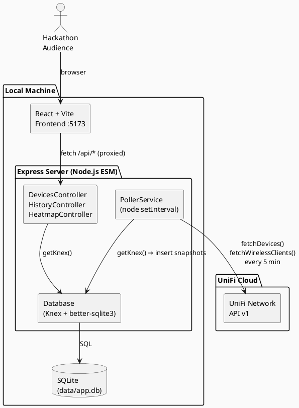
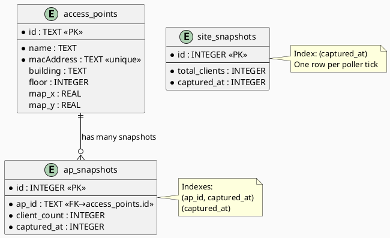
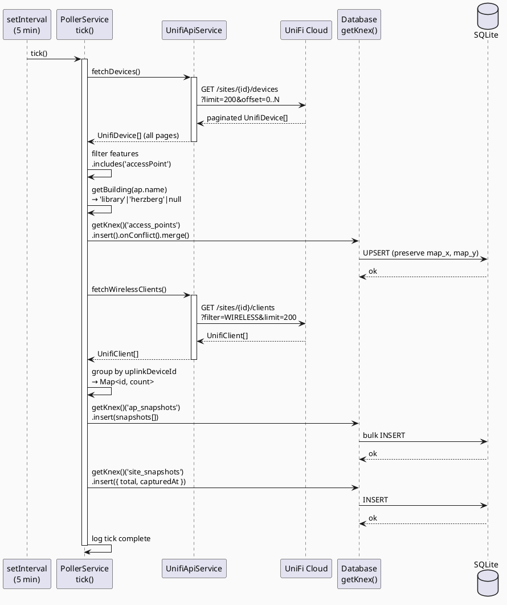
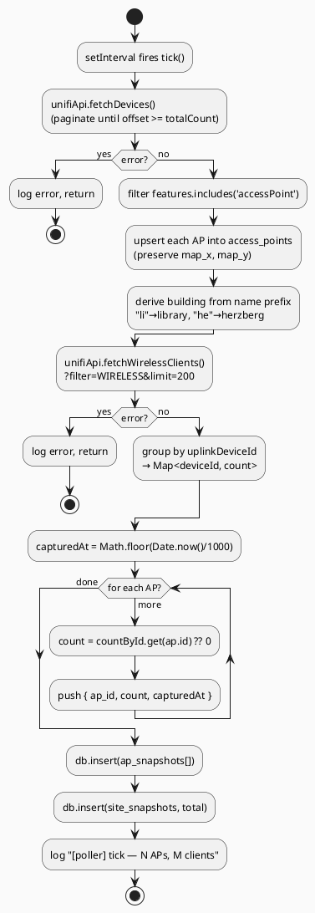
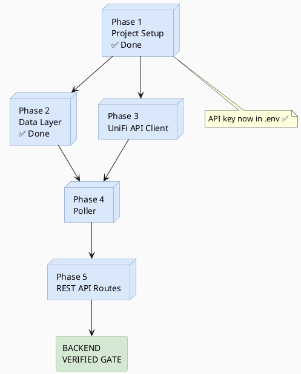

# JACHACKS ITS Challenge — Backend Plan

**Covers:** Phase 1 (Project Setup) → Phase 5 (REST API Routes)
**Stack:** Node.js + Express + TypeScript · Knex + better-sqlite3 · node-cron · tsx
**Architecture:** OOP with manual constructor-based dependency injection (no DI framework)
**Module system:** ESM (`"type": "module"` in `server/package.json`)

> See [PLAN.md](PLAN.md) for master overview and backend→frontend gate criteria.
> See [PLAN_FRONTEND.md](PLAN_FRONTEND.md) for frontend phases.

---

## Table of Contents

1. [Phase Overview](#1-phase-overview)
2. [Phase 1 — Project Setup](#2-phase-1--project-setup) ✅
3. [Phase 2 — Data Layer](#3-phase-2--data-layer)
4. [Phase 3 — UniFi API Client](#4-phase-3--unifi-api-client)
5. [Phase 4 — Poller](#5-phase-4--poller)
6. [Phase 5 — REST API Routes](#6-phase-5--rest-api-routes)
7. [Class Diagram](#7-class-diagram)
8. [PlantUML Diagrams](#8-plantuml-diagrams)
9. [API Reference (Verified)](#9-api-reference-verified)
10. [Appendix](#10-appendix)

---

## 1. Phase Overview

| Phase | Name | Status | Output |
|-------|------|--------|--------|
| 1 | Project Setup | ✅ Done | Monorepo scaffold, OOP structure, both servers start |
| 2 | Data Layer | ✅ Done | SQLite schema via Knex migrations, Database class wired |
| 3 | UniFi API Client | 🔲 Next | UnifiApiService fully implemented, verified vs live API |
| 4 | Poller | 🔲 Pending | PollerService writing snapshots every 5 min |
| 5 | REST API Routes | 🔲 Pending | All 4 endpoints returning real data |

---

## 2. Phase 1 — Project Setup ✅

### What Was Done

**Monorepo root**
- `package.json` — scripts only, `concurrently` as only dev dep
  - `npm run dev` — starts both server + client with colored labels
  - `npm run build` — builds server then client
  - `npm run install:all` — installs deps for root + server + client
- `.env` — contains `UNIFI_API_KEY`, `UNIFI_BASE_URL`, `UNIFI_SITE_ID`, `PORT`, `DB_PATH`
- `.gitignore` — covers `.env`, `node_modules/`, `data/`, `dist/`

**Server (`server/`)**
- `"type": "module"` — full ESM, no CommonJS
- `tsconfig.json` — `target: ES2022`, `module: NodeNext`, `moduleResolution: NodeNext`, strict mode
- Dev script: `tsx watch --env-file=../.env src/index.ts` (loads root `.env` directly, no dotenv import)
- All deps installed: `express`, `knex`, `better-sqlite3`, `node-cron`, `cors`, `morgan`

**OOP + DI Structure — all files created as stubs:**
```
server/src/
├── index.ts                      ← Composition root (only place new is called)
├── App.ts                        ← App class: middleware, routing, error handler
├── config.ts                     ← Config class (singleton)
├── db/
│   ├── Database.ts               ← Database class (injected with Config)
│   ├── knex.ts                   ← placeholder (Knex instance lives in Database)
│   └── migrations/
│       └── 001_initial.ts        ← Knex migration stub
├── unifi/
│   ├── types.ts                  ← UnifiDevice, UnifiClient, UnifiPage interfaces
│   ├── UnifiApiService.ts        ← UnifiApiService class (injected with Config)
│   └── api.ts                    ← placeholder
├── poller/
│   ├── PollerService.ts          ← PollerService class (injected with UnifiApiService + Database)
│   └── poller.ts                 ← placeholder
└── routes/
    ├── DevicesController.ts      ← DevicesController class (injected with Database)
    ├── HistoryController.ts      ← HistoryController class (injected with Database)
    ├── HeatmapController.ts      ← HeatmapController class (injected with Database)
    ├── devices.ts                ← placeholder
    ├── history.ts                ← placeholder
    └── heatmap.ts                ← placeholder
```

**Dependency injection wiring in `index.ts`:**
```ts
const config = Config.getInstance();
const db = new Database(config);
const unifiApi = new UnifiApiService(config);
const poller = new PollerService(unifiApi, db);
const devicesController = new DevicesController(db);
const historyController = new HistoryController(db);
const heatmapController = new HeatmapController(db);
const app = new App(config, db, poller, devicesController, historyController, heatmapController);
await app.start();
```

### Exit Criteria — All Passed ✅
- `npm run dev` from root starts both processes cleanly
- `curl http://localhost:3001/api/ping` → `{ "ok": true }`
- `http://localhost:5173` returns HTTP 200
- `npx tsc --noEmit` in `server/` passes with zero errors

---

## 3. Phase 2 — Data Layer ✅

### What Was Done

**`server/src/db/Database.ts`** — fully implemented `connect()`:
- Resolves `DB_PATH` relative to `process.cwd()` and creates parent directory with `mkdirSync({ recursive: true })`
- Instantiates Knex with `better-sqlite3` client, `useNullAsDefault: true`
- Migrations directory resolved via `__dirname` (using `fileURLToPath(import.meta.url)` for ESM compatibility)
- Calls `migrate.latest()` on connect — migrations run automatically at startup
- `getKnex()` guards against use before `connect()` with a clear error
- Added `close()` method calling `knex.destroy()` for graceful shutdown

**`server/src/db/migrations/001_initial.ts`** — implemented `up` and `down`:

| Table | Columns |
|-------|---------|
| `access_points` | `id` (PK), `mac_address` (unique), `name`, `model`, `building`, `map_x`, `map_y`, `updated_at` |
| `ap_snapshots` | `id` (auto), `ap_id` (FK→access_points), `client_count`, `epoch` — indexed `(ap_id, epoch)` |
| `site_snapshots` | `id` (auto), `total_clients`, `epoch` — indexed `(epoch)` |

**`App.ts`** — updated startup log to include full URL:
```
[server] listening on http://localhost:3001
```

### Exit Criteria — All Passed ✅
- Server logs `[db] connected — /path/to/data/app.db` on startup
- `sqlite3 data/app.db .schema` shows all three tables
- `npx tsc --noEmit` passes

### Dependencies
- Phase 1 complete ✅

---

## 4. Phase 3 — UniFi API Client

### Goal
Fully implement `UnifiApiService` with paginated device fetching and wireless client fetching. Verify against the live API before building the poller.

### Tasks

1. **`server/src/unifi/UnifiApiService.ts`** — implement `fetchDevices()` and `fetchWirelessClients()`:
   ```ts
   async fetchDevices(): Promise<UnifiDevice[]> {
     const results: UnifiDevice[] = [];
     let offset = 0;
     const limit = 200;
     do {
       const url = this.buildUrl('/devices', { limit: String(limit), offset: String(offset) });
       const page = await this.getPageFn<UnifiDevice>()(url);
       results.push(...page.data);
       offset += page.count;
       if (offset >= page.totalCount) break;
     } while (true);
     return results;
   }

   async fetchWirelessClients(): Promise<UnifiClient[]> {
     const url = this.buildUrl('/clients', { limit: '200', filter: "{type.eq('WIRELESS')}" });
     const page = await this.getPageFn<UnifiClient>()(url);
     return page.data;
   }
   ```

2. Create `server/src/unifi/test-api.ts` — run manually to verify against live API:
   ```ts
   import { Config } from '../config.js';
   import { UnifiApiService } from './UnifiApiService.js';

   const config = Config.getInstance();
   const api = new UnifiApiService(config);

   const devices = await api.fetchDevices();
   const aps = devices.filter(d => d.features.includes('accessPoint'));
   console.log(`Total devices: ${devices.length}, APs: ${aps.length}`);

   const clients = await api.fetchWirelessClients();
   console.log(`Wireless clients: ${clients.length}`);
   ```
   Run: `tsx --env-file=../.env src/unifi/test-api.ts`

### Exit Criteria
- Test script prints AP count and wireless client count without error
- Device list includes expected Herzberg APs (`he401-ap-001`, `he402-ap-001`, etc.)
- `npx tsc --noEmit` passes

### Dependencies
- Phase 1 complete ✅
- `UNIFI_API_KEY` set in `.env` ✅

---

## 5. Phase 4 — Poller

### Goal
Implement `PollerService.tick()`: fetch APs + clients, upsert access points, insert per-AP and site-level snapshots every 5 minutes.

### Tasks

1. **`server/src/poller/PollerService.ts`** — implement `tick()`:
   ```ts
   private async tick(): Promise<void> {
     try {
       const db = this.db.getKnex();

       // 1. Fetch and upsert access points
       const devices = await this.unifiApi.fetchDevices();
       const aps = devices.filter(d => d.features.includes('accessPoint'));
       for (const ap of aps) {
         await db('access_points')
           .insert({
             id: ap.id,
             name: ap.name,
             macAddress: ap.macAddress,
             building: this.getBuilding(ap.name),
           })
           .onConflict('id')
           .merge(['name', 'macAddress', 'building']); // never overwrite map_x, map_y
       }

       // 2. Fetch wireless clients, group by uplinkDeviceId
       const clients = await this.unifiApi.fetchWirelessClients();
       const countById = new Map<string, number>();
       for (const c of clients) {
         countById.set(c.uplinkDeviceId, (countById.get(c.uplinkDeviceId) ?? 0) + 1);
       }

       // 3. Insert one ap_snapshot row per AP
       const capturedAt = Math.floor(Date.now() / 1000);
       const snapshots = aps.map(ap => ({
         ap_id: ap.id,
         client_count: countById.get(ap.id) ?? 0,
         captured_at: capturedAt,
       }));
       if (snapshots.length) await db('ap_snapshots').insert(snapshots);

       // 4. Insert site_snapshot
       const total = [...countById.values()].reduce((a, b) => a + b, 0);
       await db('site_snapshots').insert({ total_clients: total, captured_at: capturedAt });

       console.log(`[poller] tick — ${aps.length} APs, ${total} wireless clients`);
     } catch (err) {
       console.error('[poller] tick error:', err);
     }
   }

   private getBuilding(name: string): string | null {
     const n = name.toLowerCase();
     if (n.startsWith('li')) return 'library';
     if (n.startsWith('he')) return 'herzberg';
     return null;
   }
   ```

### Exit Criteria
- Server logs `[poller] tick — N APs, M wireless clients` within 5 seconds of startup
- `SELECT COUNT(*) FROM ap_snapshots` > 0 after first tick
- `SELECT COUNT(*) FROM site_snapshots` > 0 after first tick

### Dependencies
- Phase 2 complete (DB tables exist)
- Phase 3 complete (UnifiApiService verified working)

---

## 6. Phase 5 — REST API Routes

### Goal
Implement the three controller classes with real Knex queries matching the API contract.

### Tasks

1. **`DevicesController.ts`** — implement `getAll()`:
   ```ts
   private getAll(_req: Request, res: Response): void {
     const rows = this.db.getKnex()('access_points').orderBy(['building', 'name']);
     res.json(rows);
   }
   ```

2. **`HistoryController.ts`** — implement `getHistory()`:
   ```ts
   private getHistory(req: Request, res: Response): void {
     const now = Math.floor(Date.now() / 1000);
     const from = Number(req.query['from'] ?? now - 86400);
     const to = Number(req.query['to'] ?? now);
     const apId = req.query['ap_id'] as string | undefined;

     if (isNaN(from) || isNaN(to)) {
       res.status(400).json({ error: 'from and to must be epoch seconds' });
       return;
     }

     const db = this.db.getKnex();
     let query;
     if (apId) {
       query = db('ap_snapshots')
         .select('captured_at', 'client_count')
         .where('ap_id', apId)
         .whereBetween('captured_at', [from, to])
         .orderBy('captured_at', 'asc')
         .limit(2016);
     } else {
       query = db('site_snapshots')
         .select('captured_at', 'total_clients as client_count')
         .whereBetween('captured_at', [from, to])
         .orderBy('captured_at', 'asc')
         .limit(2016);
     }
     res.json(query);
   }
   ```

3. **`HeatmapController.ts`** — implement `getCurrent()`:
   ```ts
   private getCurrent(_req: Request, res: Response): void {
     const db = this.db.getKnex();
     const rows = db('access_points as ap')
       .leftJoin('ap_snapshots as s', function () {
         this.on('s.ap_id', '=', 'ap.id').andOn(
           's.captured_at',
           '=',
           db.raw('(SELECT MAX(s2.captured_at) FROM ap_snapshots s2 WHERE s2.ap_id = ap.id)')
         );
       })
       .select(
         'ap.id as ap_id', 'ap.name', 'ap.building', 'ap.map_x', 'ap.map_y',
         db.raw('COALESCE(s.client_count, 0) as client_count')
       );
     res.json(rows);
   }
   ```

### Exit Criteria
All backend gate checks pass (see [PLAN.md](PLAN.md)):
- `curl http://localhost:3001/api/ping` → `{ "ok": true }`
- `curl http://localhost:3001/api/devices` → array with AP rows including `building`
- `curl "http://localhost:3001/api/history"` → time-series array
- `curl http://localhost:3001/api/heatmap/current` → AP array with `client_count`

### Dependencies
- Phase 4 complete (poller has written data to DB)

---

## 7. Class Diagram



---

## 8. PlantUML Diagrams

### 8.1 System Context



### 8.2 Database ERD



### 8.3 Poller Tick Sequence



### 8.4 Poller Activity Diagram



### 8.5 Backend Phase Dependency



---

## 9. API Reference (Verified from Live Environment)

### Base URL
```
https://cd5d2039-c421-41c5-8453-d51b5ed8e6ec.unifi-hosting.ui.com/proxy/network/integration/v1
```

### Auth Header
```
X-API-KEY: <your_key>
Accept: application/json
```

### Target Site
```json
{ "id": "88f7af54-98f8-306a-a1c7-c9349722b1f6", "name": "JAC Campus" }
```

### Devices — confirmed shape
```
GET /sites/88f7af54-.../devices?limit=200&offset=0
totalCount: 547 — must paginate
```
```json
{
  "id": "a2ab7a8e-b58d-32c4-b812-41adb00a56ca",
  "macAddress": "60:22:32:69:1a:d4",
  "name": "he401-ap-001",
  "model": "U6 Enterprise",
  "state": "ONLINE",
  "features": ["accessPoint"],
  "interfaces": ["radios"]
}
```

### Clients — confirmed shape
```
GET /sites/88f7af54-.../clients?limit=200&filter={type.eq('WIRELESS')}
totalCount (all): 3249 — wireless-filtered count is well under 200 during event
```
```json
{
  "type": "WIRELESS",
  "id": "...",
  "macAddress": "...",
  "uplinkDeviceId": "a2ab7a8e-b58d-32c4-b812-41adb00a56ca",
  "connectedAt": "2025-10-03T12:36:42Z",
  "access": { "type": "DEFAULT" }
}
```

---

## 10. Appendix

### OOP + DI Rules
- `index.ts` is the **only** file that calls `new` on top-level classes
- Every class receives its dependencies through its **constructor** — never imports a singleton directly (except `Config.getInstance()` in `index.ts`)
- No DI framework — constructor injection is manual and explicit

### AP Detection
`device.features.includes('accessPoint')` — covers pure APs and combo devices (IW HD)

### Client-to-AP Linkage
`client.uplinkDeviceId` (UUID) matches `access_points.id` (= `device.id`). Never use MAC for this join.

### Building Prefix Convention
| Prefix | Building |
|--------|----------|
| `li` | `library` |
| `he` | `herzberg` |
| other | `null` |

### AP Coordinate Seeding
After floor plans are available, run a one-off seed script updating `map_x`/`map_y` in `access_points`. Values are percentages (0–100) relative to floor plan image size. The poller upsert deliberately excludes these columns so they are never overwritten.

### SQLite Scale (12-hour hackathon, ~50 APs)
| Table | Rows |
|-------|------|
| `access_points` | ~50 |
| `ap_snapshots` | 144 ticks × 50 = 7,200 |
| `site_snapshots` | 144 |

### Security
`UNIFI_API_KEY` is in `.env` (gitignored), read only by `Config`, never serialised into any API response.
