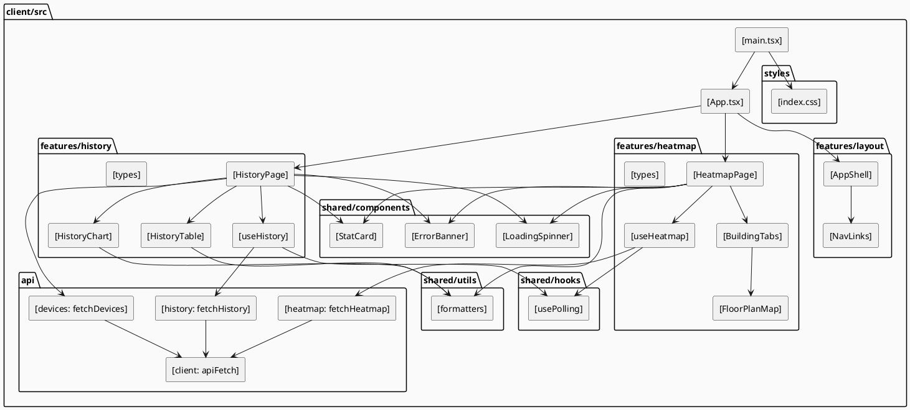
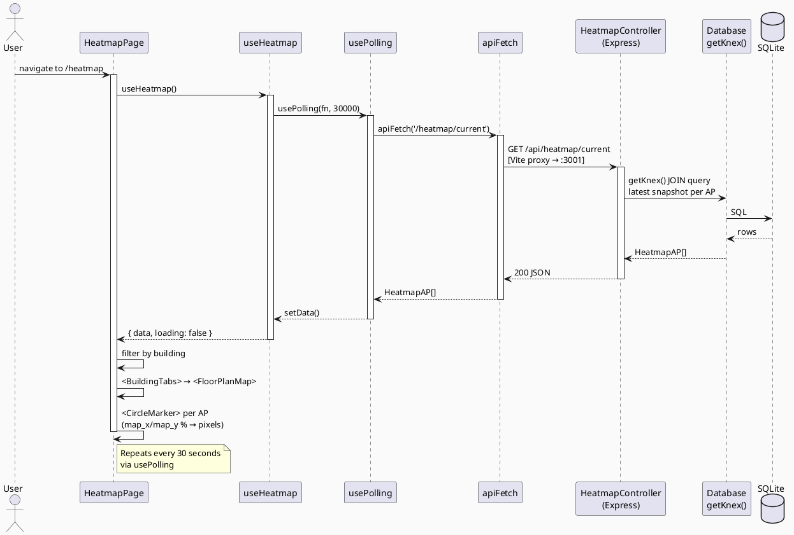
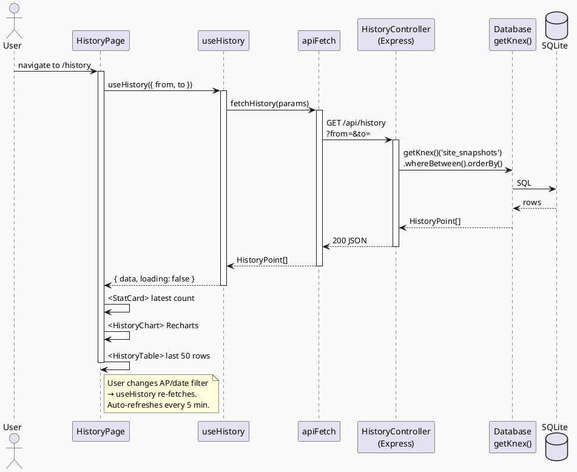
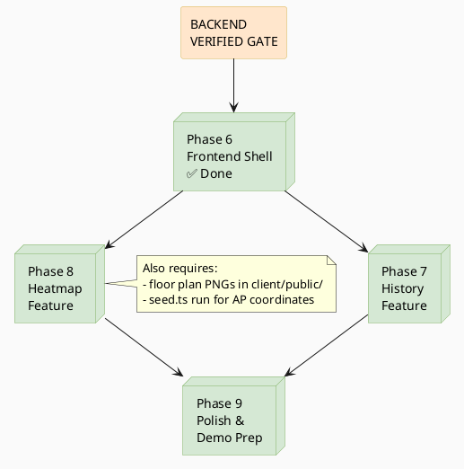

# JACHACKS ITS Challenge — Frontend Plan

**Covers:** Phase 6 (Frontend Shell) → Phase 9 (Polish & Demo Prep)
**Stack:** React 19 + Vite 8 + TypeScript · Tailwind CSS v4 · Recharts · react-leaflet
**Architecture:** Modular feature-based structure with custom hooks and a typed API layer

> See [PLAN.md](PLAN.md) for master overview.
> See [PLAN_BACKEND.md](PLAN_BACKEND.md) for Phase 1–5 (must be complete before starting here).

---

## Entry Condition — Backend Gate

**Do not start any frontend phase until all four checks pass:**

```bash
curl http://localhost:3001/api/ping
# → { "ok": true }

curl http://localhost:3001/api/devices
# → [{ "id": "...", "name": "he401-ap-001", "building": "herzberg", ... }]

curl "http://localhost:3001/api/history"
# → [{ "captured_at": 1234567890, "client_count": 42 }, ...]

curl http://localhost:3001/api/heatmap/current
# → [{ "ap_id": "...", "name": "...", "client_count": 12, ... }]
```

---

## Table of Contents

1. [Phase Overview](#1-phase-overview)
2. [Phase 6 — Frontend Shell & Shared](#2-phase-6--frontend-shell--shared) ✅
3. [Phase 7 — History Feature](#3-phase-7--history-feature)
4. [Phase 8 — Heatmap Feature](#4-phase-8--heatmap-feature)
5. [Phase 9 — Polish & Demo Prep](#5-phase-9--polish--demo-prep)
6. [API Contract (Backend Guarantee)](#6-api-contract-backend-guarantee)
7. [PlantUML Diagrams](#7-plantuml-diagrams)

---

## 1. Phase Overview

| Phase | Name | Status | Output |
|-------|------|--------|--------|
| 6 | Frontend Shell & Shared | ✅ Done | App routing, nav, shared components, api layer, usePolling |
| 7 | History Feature | 🔲 Next | Recharts time-series chart + data table |
| 8 | Heatmap Feature | 🔲 Pending | react-leaflet floor plan + AP circle markers |
| 9 | Polish & Demo Prep | 🔲 Pending | Error states, loading skeletons, stale-data warnings |

---

## 2. Phase 6 — Frontend Shell & Shared ✅

### What Was Done

**Project setup**
- Vite 8 + React 19 + TypeScript scaffolded via `npm create vite@latest`
- **Tailwind CSS v4** — uses `@tailwindcss/vite` plugin (no config file), single `@import "tailwindcss"` in CSS
- `react-router-dom`, `recharts`, `react-leaflet`, `leaflet` installed
- `@` path alias in both `vite.config.ts` and `tsconfig.app.json`
- `/api` → `http://localhost:3001` proxy in `vite.config.ts`
- `"type": "commonjs"` removed from root `package.json`

**Directory structure — all files created:**
```
client/src/
├── styles/
│   └── index.css                    ← @import "tailwindcss" + dark mode variant
├── main.tsx                         ← BrowserRouter wrapper, imports styles/index.css
├── App.tsx                          ← Routes + Tailwind nav bar
├── api/
│   ├── client.ts                    ← apiFetch<T>() base wrapper
│   ├── history.ts                   ← fetchHistory() stub
│   ├── heatmap.ts                   ← fetchHeatmap() stub
│   └── devices.ts                   ← fetchDevices() stub
├── features/
│   ├── layout/
│   │   ├── AppShell.tsx             ← stub
│   │   └── NavLinks.tsx             ← stub
│   ├── history/
│   │   ├── HistoryPage.tsx          ← stub placeholder page
│   │   ├── HistoryChart.tsx         ← stub
│   │   ├── HistoryTable.tsx         ← stub
│   │   ├── useHistory.ts            ← stub
│   │   └── types.ts                 ← stub
│   └── heatmap/
│       ├── HeatmapPage.tsx          ← stub placeholder page
│       ├── FloorPlanMap.tsx         ← stub
│       ├── BuildingTabs.tsx         ← stub
│       ├── useHeatmap.ts            ← stub
│       └── types.ts                 ← stub
└── shared/
    ├── components/
    │   ├── LoadingSpinner.tsx        ← animate-spin, fully implemented
    │   ├── ErrorBanner.tsx          ← red banner, fully implemented
    │   └── StatCard.tsx             ← label+value card, fully implemented
    ├── hooks/
    │   └── usePolling.ts            ← fully implemented (useRef + setInterval)
    └── utils/
        └── formatters.ts            ← formatEpoch, formatEpochFull, getBuilding
```

**`apiFetch` base wrapper (implemented):**
```ts
export async function apiFetch<T>(
  path: string,
  params?: Record<string, string>
): Promise<T> {
  const url = params
    ? `/api${path}?${new URLSearchParams(params)}`
    : `/api${path}`;
  const res = await fetch(url, { signal: AbortSignal.timeout(10_000) });
  if (!res.ok) {
    const body = await res.json().catch(() => ({})) as { error?: string };
    throw new Error(body.error ?? `HTTP ${res.status}`);
  }
  return res.json() as Promise<T>;
}
```

**`usePolling` hook (implemented):**
```ts
export function usePolling(callback: () => void, intervalMs: number, immediate = true): void {
  const savedCallback = useRef(callback);
  useEffect(() => { savedCallback.current = callback; }, [callback]);
  useEffect(() => {
    if (immediate) savedCallback.current();
    const id = setInterval(() => savedCallback.current(), intervalMs);
    return () => clearInterval(id);
  }, [intervalMs, immediate]);
}
```

### Exit Criteria — All Passed ✅
- `http://localhost:5173` loads with nav bar, routes to `/history` and `/heatmap`
- `npx tsc --noEmit` in `client/` passes with zero errors
- `apiFetch('/devices')` callable from browser console

---

## 3. Phase 7 — History Feature

### Goal
Render a full history page with a time-series line chart (Recharts) and a scrollable data table, with AP filter and date range controls. Auto-refreshes every 5 minutes.

### Tasks

1. **`client/src/features/history/types.ts`**:
   ```ts
   export interface HistoryPoint {
     captured_at: number;
     client_count: number;
   }
   export interface HistoryParams {
     from?: number;
     to?: number;
     ap_id?: string;
   }
   export interface Device {
     id: string;
     name: string;
     building: string | null;
   }
   ```

2. **`client/src/api/history.ts`**:
   ```ts
   export async function fetchHistory(params: HistoryParams): Promise<HistoryPoint[]> {
     const p: Record<string, string> = {};
     if (params.from) p['from'] = String(params.from);
     if (params.to) p['to'] = String(params.to);
     if (params.ap_id) p['ap_id'] = params.ap_id;
     return apiFetch<HistoryPoint[]>('/history', p);
   }
   ```

3. **`client/src/api/devices.ts`**:
   ```ts
   export async function fetchDevices(): Promise<Device[]> {
     return apiFetch<Device[]>('/devices');
   }
   ```

4. **`client/src/features/history/useHistory.ts`**:
   - Accepts `HistoryParams`
   - State: `data: HistoryPoint[]`, `loading: boolean`, `error: string | null`
   - Calls `fetchHistory(params)` on mount and when params change (`useEffect` dep on params)
   - Uses `usePolling` at 5-minute interval for auto-refresh

5. **`client/src/features/history/HistoryChart.tsx`**:
   - Props: `data: HistoryPoint[]`
   - Recharts `<ResponsiveContainer width="100%" height={350}>` wrapping `<LineChart>`
   - `<XAxis dataKey="captured_at" tickFormatter={formatEpoch} />`
   - `<YAxis allowDecimals={false} domain={[0, 'auto']} />`
   - `<Tooltip labelFormatter={formatEpochFull} />`
   - `<CartesianGrid strokeDasharray="3 3" />`
   - `<Line type="monotone" dataKey="client_count" stroke="#2563eb" dot={false} />`
   - Empty state: `<p>No data for selected range.</p>` when `data.length === 0`

6. **`client/src/features/history/HistoryTable.tsx`**:
   - Props: `data: HistoryPoint[]`
   - Tailwind-styled `<table>` — no library
   - Columns: **Timestamp** (`formatEpochFull`), **Clients**
   - Shows most recent 50 rows (slice + reverse), fixed height + `overflow-y-auto`

7. **`client/src/features/history/HistoryPage.tsx`**:
   - AP `<select>` dropdown populated from `fetchDevices()`, default "All (Site-wide)"
   - Two `<input type="datetime-local">` for date range, defaulting to last 24 hours
   - `<StatCard label="Active Clients" value={data.at(-1)?.client_count ?? 0} />`
   - Composes `useHistory(params)` → renders `<HistoryChart>` and `<HistoryTable>`
   - Shows `<LoadingSpinner />` on initial load, `<ErrorBanner message={error} />` on error

### Exit Criteria
- Chart renders with real data from the DB (requires Phase 4 poller to have run at least once)
- Changing AP filter re-fetches and updates chart + table for that AP
- Date range filter narrows data correctly
- Page auto-refreshes every 5 min (visible in browser network tab)
- Empty range shows "No data" gracefully — no crash

### Dependencies
- Phase 6 complete ✅ (AppShell, `apiFetch`, `usePolling`, shared components)
- `/api/history` and `/api/devices` returning real data

---

## 4. Phase 8 — Heatmap Feature

### Goal
Display react-leaflet maps with floor plan image overlays and coloured circle markers per AP, sized and coloured by current client count. One tab per building.

### Tasks

1. **`client/src/features/heatmap/types.ts`**:
   ```ts
   export type Building = 'library' | 'herzberg';

   export interface HeatmapAP {
     ap_id: string;
     name: string;
     building: Building | null;
     map_x: number | null;   // 0–100 percentage of floor plan width
     map_y: number | null;   // 0–100 percentage of floor plan height
     client_count: number;
   }
   ```

2. **`client/src/api/heatmap.ts`**:
   ```ts
   export async function fetchHeatmap(): Promise<HeatmapAP[]> {
     return apiFetch<HeatmapAP[]>('/heatmap/current');
   }
   ```

3. **`client/src/features/heatmap/useHeatmap.ts`**:
   - Calls `fetchHeatmap()` on mount
   - Uses `usePolling` at 30-second interval
   - Returns `{ data: HeatmapAP[], loading, error, lastUpdated: number | null }`

4. Place converted floor plan PNGs when available:
   - `client/public/library.png`
   - `client/public/herzberg.png`

5. **`client/src/features/heatmap/FloorPlanMap.tsx`**:
   - Props: `{ building: Building; aps: HeatmapAP[] }`
   - Import `leaflet/dist/leaflet.css` at top of file
   - Image dimensions (update once PNGs are available):
     ```ts
     const DIMS: Record<Building, { w: number; h: number }> = {
       library:  { w: 2000, h: 1414 },
       herzberg: { w: 2000, h: 1414 },
     };
     ```
   - `<MapContainer crs={CRS.Simple} bounds={[[0,0],[h,w]]} style={{ height: '600px' }}>`
   - `<ImageOverlay url={`/${building}.png`} bounds={[[0,0],[h,w]]} />`
   - Per AP with non-null coords — convert percentage to pixels:
     ```ts
     const py = (ap.map_y! / 100) * h;
     const px = (ap.map_x! / 100) * w;
     const radius = Math.max(10, Math.min(40, ap.client_count * 3));
     ```
   - Color helper:
     ```ts
     function countToColor(count: number): string {
       const ratio = Math.min(count / 20, 1);
       const hue = Math.round((1 - ratio) * 120); // 120=green → 0=red
       return `hsl(${hue}, 80%, 45%)`;
     }
     ```
   - `<CircleMarker position={[py, px]} radius={radius} fillColor={color} fillOpacity={0.8} stroke={false}>`
     - `<Tooltip permanent>{ap.client_count}</Tooltip>`
     - `<Popup>{ap.name} — {ap.client_count} clients</Popup>`
   - APs with null coords are excluded from the map; listed separately in the unmapped sidebar

6. **`client/src/features/heatmap/BuildingTabs.tsx`**:
   - Tailwind-styled tab buttons (no library) switching between `library` and `herzberg`
   - Passes filtered `aps.filter(a => a.building === activeBuilding)` to `<FloorPlanMap>`

7. **`client/src/features/heatmap/HeatmapPage.tsx`**:
   - Composes `useHeatmap` hook
   - `<StatCard label="Total Wireless Clients" value={totalClients} />`
   - `<BuildingTabs aps={data} />`
   - "Last updated: {formatEpochFull(lastUpdated)}" timestamp
   - Sidebar listing unmapped APs: `data.filter(a => a.map_x === null).map(a => a.name)`
   - `<LoadingSpinner />` and `<ErrorBanner />` states

### Coordinate Note
`map_x`/`map_y` are stored as 0–100 percentages. Leaflet `CRS.Simple` uses `[lat=y, lng=x]`:
```ts
const position: LatLngExpression = [py, px]; // [y, x]
```

### Exit Criteria
- Both building tabs render the floor plan image in the Leaflet container
- AP circles appear at seeded positions (after seed script has run)
- Circles update on 30-second refresh cycle
- Clicking a circle shows popup with AP name + count
- Unmapped APs listed in sidebar — not silently dropped
- `leaflet.css` imported — no missing icon errors

### Dependencies
- Phase 6 complete ✅
- `/api/heatmap/current` returning real data
- `server/src/db/seed.ts` run once to populate `map_x`/`map_y` for known APs
- Floor plan PNGs in `client/public/`

---

## 5. Phase 9 — Polish & Demo Prep

### Goal
Harden for live demo: graceful error/stale-data handling, loading skeletons, and a full end-to-end walkthrough.

### Tasks

1. **Stale data warning** — track last success in `usePolling`:
   ```ts
   // If last success was > 2× the interval ago, show warning banner
   if (lastSuccessAt && Date.now() - lastSuccessAt > 2 * intervalMs) {
     // render <ErrorBanner message="Data may be stale" />
   }
   ```

2. **Loading skeletons** — replace initial `<LoadingSpinner>` with Tailwind `animate-pulse` placeholder shapes matching the chart/map layout

3. **Page titles** via `document.title` in each page component:
   - History: `"Client History — UniFi Dashboard"`
   - Heatmap: `"Occupancy Heatmap — UniFi Dashboard"`

4. **`leaflet.css`** — confirm imported in `FloorPlanMap.tsx` (prevents missing tile icons)

5. **Recharts responsive check** — verify `<ResponsiveContainer>` renders correctly on 1080p and laptop screens

6. **Final end-to-end walkthrough**:
   - Delete `data/app.db`
   - `npm run dev` from root
   - Poller tick logs within 5 seconds
   - History page shows chart with real data
   - Heatmap page renders floor plan + AP circles
   - Network tab shows heatmap polling every 30 s
   - Browser console is clean (no errors)

### Exit Criteria
- App starts from empty DB and shows real data within 10 seconds
- Browser console clean
- Stale data warning appears if backend is stopped while frontend is running
- Both pages presentable on a 1080p screen

### Dependencies
- Phase 7 and Phase 8 complete

---

## 6. API Contract (Backend Guarantee)

### `GET /api/ping`
```json
{ "ok": true }
```

### `GET /api/devices`
```json
[
  {
    "id": "a2ab7a8e-b58d-32c4-b812-41adb00a56ca",
    "name": "he401-ap-001",
    "macAddress": "60:22:32:69:1a:d4",
    "building": "herzberg",
    "floor": null,
    "map_x": null,
    "map_y": null
  }
]
```

### `GET /api/history?from=&to=&ap_id=`
```json
[
  { "captured_at": 1712844300, "client_count": 47 },
  { "captured_at": 1712844600, "client_count": 51 }
]
```
- `from`/`to` — Unix epoch seconds (optional, defaults to last 24 hours)
- `ap_id` — optional; omit for site-wide totals
- Sorted ascending by `captured_at`, capped at 2016 rows

### `GET /api/heatmap/current`
```json
[
  {
    "ap_id": "a2ab7a8e-b58d-32c4-b812-41adb00a56ca",
    "name": "he401-ap-001",
    "building": "herzberg",
    "map_x": 42.5,
    "map_y": 31.0,
    "client_count": 12
  }
]
```
- `map_x`/`map_y` are percentages (0–100) or `null` if not yet seeded
- One row per AP; APs with `null` coordinates must still appear (shown in unmapped sidebar)

---

## 7. PlantUML Diagrams

### 7.1 Frontend Component Diagram



### 7.2 Heatmap Data Flow Sequence



### 7.3 History Data Flow Sequence



### 7.4 Frontend Phase Dependency


